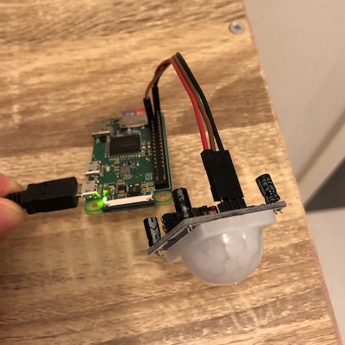

# homebridge-hcsr501-sensor-script

[Homebridge](https://github.com/nfarina/homebridge) pluging for execute custom scripts when hc-sr501 motion sensor on a Raspberry Pi is trigger.



## Installation

Run the following command
```
npm install -g --unsafe-perm homebridge-hcsr501-sensor-script
```

**Note:** depending on your platform you might need to run `npm install -g` with root privileges.

See the [Homebridge documentation](https://github.com/nfarina/homebridge#readme) for more information.

## Configuration

Update your Homebridge `config.json` file. See [config-sample.json](config-sample.json) for a complete example.

```
"accessories" : [
    {
        "accessory": "HCSR501-script",
        "name": "Motion Sensor",
        "pinId": 24,
        "start": "~/start.sh",
        "stop": "~/stop.sh"
    }
]
```

Name | Value | Required | Notes
----------- | ------- | -------------- | --------------
accessory | HCSR501-script | yes | Must be set to "HCSR501-script"
name | _(custom)_ | yes | Name of accessory that will appear in [HomeKit](https://www.apple.com/ios/home/) app
pinId | _(custom)_ | yes | The pin you connected the motion sensor
start | _(custom)_ | yes | Location of script to execute the start action
stop | _(custom)_ | yes | Location of script to execute the stop action
manufacturer | _(custom)_ | optional | The text of manufacturer
model | _(custom)_ | optional | The text of model
serial | _(custom)_ | optional | The text of serial
